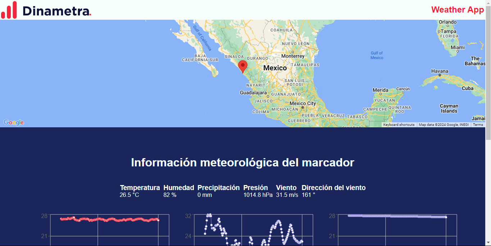

# Dashboard para Dinametra

En este reposiorio se muestra la elaboracion de un proyecto para calificar para el puesto de desarrollador Frond-end

## Comando para instalar dependecias 
$ npm install

## Comando para correr la app
$ npm run dev

Screenshots

