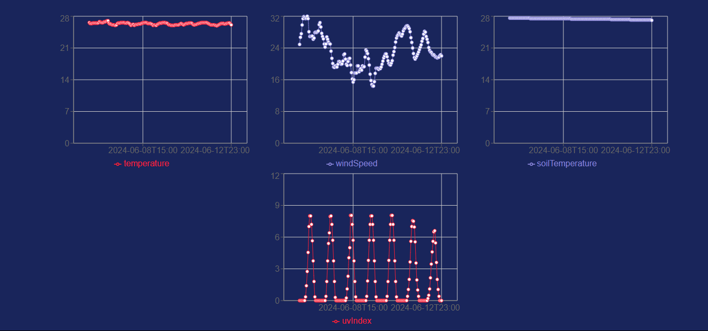

# Dashboard para Dinametra

En este repositorio se muestra la elaboracion de un proyecto para calificar para el puesto de desarrollador Frond-end

En la aplicacion se muestra un mapa con el que se puede interactuar para obtener la informacion atmosferica de la zona marcada, solamente es necesario mover el marker que se muestra.

## Comando para instalar dependecias 
$ npm install

## Comando para correr la app
$ npm run dev

Screenshots

Graficas de los datos atmosfericos obtenidos

